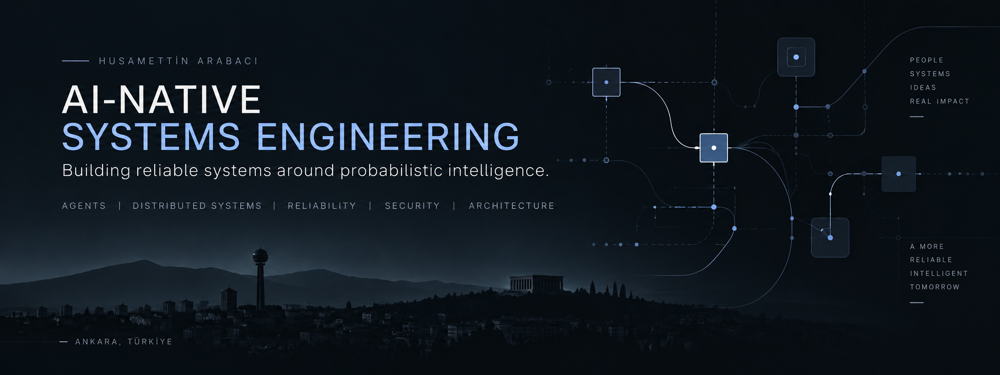

  

# Husamettin ARABACI

**Principal AI Systems Architect · AI-Native Systems Engineering**

I design and build production-grade systems where **AI agents, models, distributed software, cloud, and edge infrastructure** operate as one engineered system.

My background spans 20+ years of software and systems engineering, with deep experience in **distributed systems, backend architecture, high-performance systems, reliability, security, IoT, embedded systems, and edge computing**.

Today, my work is increasingly focused on engineering reliable systems around probabilistic intelligence.

## Engineering Focus

* **AI-Native Systems Architecture**
* **Agentic & Multi-Agent Systems**
* **Distributed Systems**
* **AI Platform & Control Plane Architecture**
* **Durable Agent Execution**
* **Evaluation & Verification**
* **AI Security & Authority Delegation**
* **Reliability & Failure Engineering**
* **Observability & Forensics**
* **Context, Memory, RAG & MCP**
* **AI-Native Software Development**
* **Hybrid Cloud & Edge Systems**

## How I Think About AI Systems

A model is only one component of a production AI system.

The harder engineering problems emerge around it:

**state · authority · context · verification · failure · observability · reliability · cost**

My focus is on designing those boundaries explicitly and turning probabilistic intelligence into systems that can operate safely and predictably in production environments.

## Current Engineering Work

I'm currently exploring and building across:

* Agent execution and orchestration
* Tool and MCP architectures
* Context and memory systems
* Verification and evaluation pipelines
* Agent security and permission boundaries
* Durable AI workflows
* AI platform architecture
* AI control planes
* Distributed and hybrid AI execution
* Reliability patterns for nondeterministic systems

The emphasis is on **working implementations, architecture decisions, experiments, failure analysis, and measurable evidence**.

## Selected Systems Background

My engineering experience includes:

* Large-scale distributed and concurrent systems
* High-throughput telemetry and streaming architectures
* Backend and platform engineering
* Reliability and fault-tolerant system design
* Security-sensitive systems
* High-performance data processing
* IoT, RF, embedded and edge systems
* Cloud infrastructure and CI/CD
* Technical architecture and engineering leadership

## Open Source

My repositories increasingly serve as an engineering notebook for **AI-Native Systems Engineering** — implementations, experiments, benchmarks, architectural patterns, and failure investigations.

As this work develops, the strongest artifacts will be documented and pinned here.

---

[Website](https://husamettinarabaci.com) · [X](https://x.com/hsmarabaci) · [daily.dev](https://daily.dev/husamettinarabaci)

